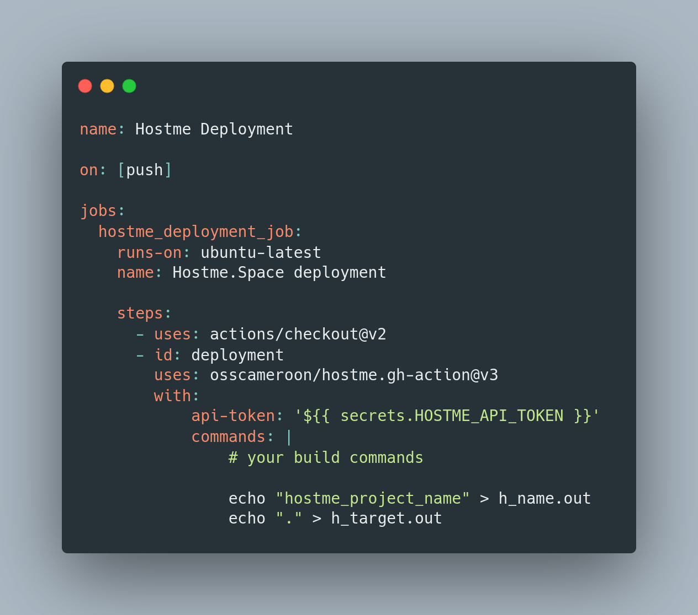

# Hostme.gh-action

`Hostme.gh-action` (https://hostme.space/) is a github action to zip and deploy your project directly on Hostme.Space


# Requirements :

All this gh-action need :
 - curl

# Features :

What this ghaction do :
 - Run your custom inputs commands
 - generate the zip folder depending on the project name you gave
 - Post the zip file on hostme.space

# Integration example :

- Example available [here](https://github.com/osscameroon/hostme.gh-action.example).

- Screenshot :



Some explanations with comments:
```yaml
api-token: '${{ secrets.HOSTME_API_TOKEN }}'
# We just build the website (if needed) and provide
# the name of the hostme project inside a file
commands: |
    yarn build
    # ... all other commands here
    mv ./build ./hostme_project_name
    
    # this step is really important...
    # otherwise, the github action will not deploy correctly
    echo "hostme_project_name" > h_name.out
```

